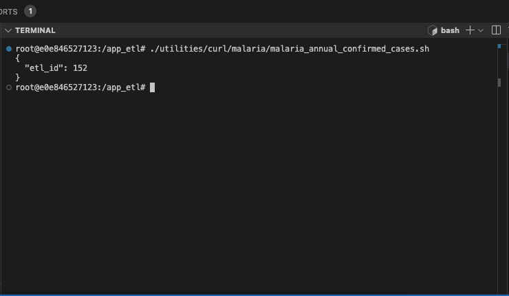
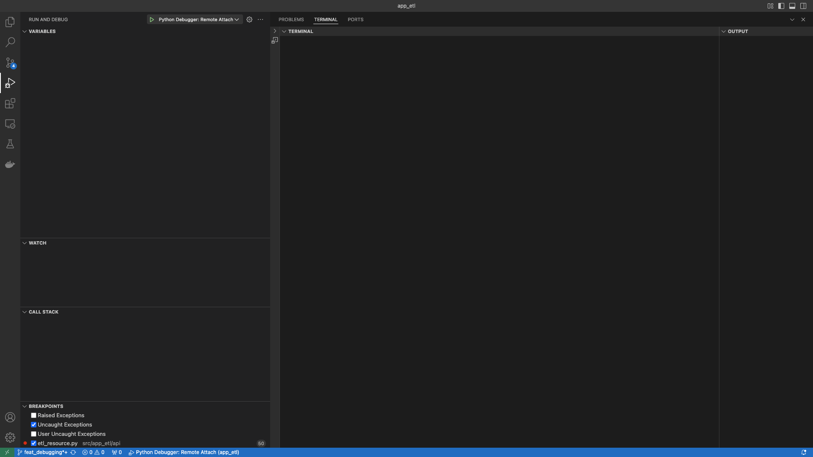

# app_etl


An API driven ETL program to extract data from World Health Organization.

## Supported Datasets:
- Malaria Annual Confirmed Cases
- ...

## Project Structure:
- docs: Project documentation lives in here.
- src: production code lives in folder and is divided in the modules below:
    - app_etl: Project package.
        - api:
            - The API to the application lives in this module.
            - The current implementation is a REST API, but a gRPC, CLI API, etc would be implemented in here.
        - config:
            - Configurable values live in here.
            - These are values such as Hand Ranks, Card Ranks.
                - as the system scales, you could migrate these into a database to allow independently
                changing config without restarting the application.
        - core:
            - The domain logic of the application lives in this module.
        - gateway:
            - All external interaction objects(e.g. files, external APIs etc) live in this module.
        - model:
            - The domain models for Poker live in this in this module.
        - repository:
            - Data interactions(persitence and access) concerns live in this module.
        - app.py:
            Entry point to startup the application
- tests: Test code lives in folder.
    The tests are intentionally separated from production code.
    - benefits:
        - Tests can run against an installed version after executing `pip install .`.
        - Tests can run against the local copy with an editable install after executing `pip install --edit`.
        - When using Docker, the entire app_etl folder can be copied without needing to exclude tests, which we don't release to PROD.
    - more in depth discussion here: https://docs.pytest.org/en/latest/explanation/goodpractices.html#choosing-a-test-layout-import-rules

- utilities: Any useful scripts, such as curl & postman requests, JSON payloads, software installations, etc.

## Setup Instructions:
- Install [Docker](https://docs.docker.com/get-started/)
- The repository is configure to use Dev Containers for development.
    - [containers.dev](https://containers.dev)
    - [Developing inside a Container](https://code.visualstudio.com/docs/devcontainers/containers)

## Package Management:
**NB**: Only required if you choose to not use dev containers.
- Install [Pipenv](https://pypi.org/project/pipenv/)

- Install packages into local environment using pipenv:
    ```shell
    pipenv install
    ```
## Run Program:
- Start the system
    ```shell
    ./start_system.sh
    ```
- Run an ETL
    ```shell
    # specifically imports malaria_annual_confirmed_cases
    ./utilities/curl/malaria/malaria_annual_confirmed_cases.sh
    ```

## Testing:
### unit tests:
- To run tests:
    - activate environment
    ```shell
    pipenv shell
    ```
    - run tests
    ```shell
    pytest
    ```

### end to end tests:
- Start the system
    ```shell
    ./start_system.sh
    ```
- The curl request used can be found in `utilities/curl/`.
    - Example:
        ```shell
        ./utilities/curl/malaria/malaria_annual_confirmed_cases.sh
        ```
    - Output:
         <br>

## Development:
- To run system in debug mode:
    ```shell
    ./start_system.sh
    ```
- Running in VSCode:
    - Start the system in debubg mode.
    ```shell
    docker compose -f docker-compose.debug.yml up
    ```
    - Open the "Run and Debug" view.
    - Click the green play button.<br>
        
    - Allow debugging without frozen modules by clicking "Debug Anyway" once the app_etl is ready and the "Set PYDEVD_DISABLE_FILE_VALIDATION=1 to disable this validation" is shown.
        
    - The server will inform you the host and port in the terminal output at the bottom.
    - From here you debug like normal(i.e. add break points, step into code definitions, evaluate code snippets, etc) <br>

## Database State Management:

- The database state (i.e. tables, stored procedures, indexes, etc) are managed using [Alembic](https://alembic.sqlalchemy.org/en/latest/).
    - Migrations location: src/app_etl/migrations
    - Migrations naming scheme: YYYY_MM_DD_HHMM_rev_nanme
        - uses alembic's full revision scheme defined in alembic.ini
        - example: `2025_02_08_0825-98af2865f6fc_create_schema_etl`
    - Current database state can be queried with `SELECT * FROM public.alembic_version;`
- To upgrade the database to latest migrations:
    ```shell
    alembic upgrade head
    ```
- To downgrade the database to the base state:
    ```shell
    alembic downgrade base
    ```

## Git Conventions:
- **NB:** the main is locked and all changes must come through a Pull Request.
- Commit Messages:
    - Provide concise commit messages that describe what you have done.
        ```shell
        # example:
        git commit -m "feat(core): algorithm" -m"implement my new shiny faster algorithm"
        ```
    - References:
        - https://www.conventionalcommits.org/en/v1.0.0/
        - https://www.freecodecamp.org/news/how-to-write-better-git-commit-messages/

## Demo:

**Disclaimer**: This is still work in progress.
